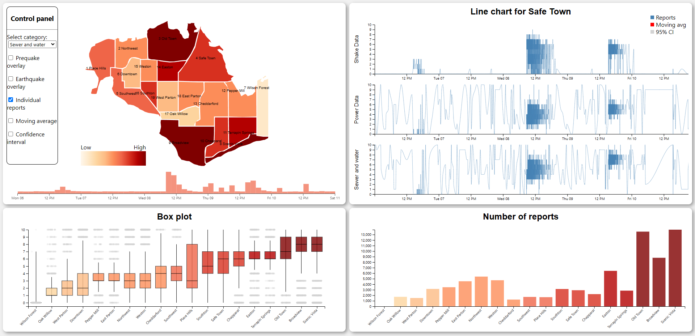

# TNM098 - Project VAST MC1 2019

Final project in course TNM098 - Advanced Visual Data Analysis at Linköping University VT2023

Project is based on the VAST Mini-Challenge 1 from 2019 ([available here](https://vast-challenge.github.io/2019/MC1.html)).

## Tool description

The tool is split into four different views, providing four insights into the data. The main view (top left) consists of a choropleth map displaying the average value for each region of the selected category. The category can be selected through the panel on the side, and additionally toggle the earth quake overlay.

The bottom left displays a box plot of the selected category for each region, making it possible to determine the spread and uncertainty of reports. The box plots reveal the median, the lower and upper quartile and the minimum and maximum values, as well as outliers. The bars are sorted from left to right after the average value reported for the region, with the same colour coding as the choropleth map.

The bottom right view consists of a bar chart displaying the total number of reports per region for the selected category. The bars are also colour coded in the same way as the map, and sorted similarly to the box plot.

The top right displays three different line charts for a selected region, with the actual reports plotted vs the time. Shake and power data are always displayed, since they are considered the most important categories, and the third line chart displays the selected category. The charts can be customised to show the moving average of 50 since reports can vary a lot over a short period of time. The average can also be combined with a 95 % confidence interval to show the spread of samples.

The different views are linked together by changing the colour of the map/bars of a hovered region to a light blue hue. A tooltip is also displayed next to the cursor with additional data, such as average value of the selected category, lower and upper quartile, median and number of reports.

Lastly, a histogram is displayed under the map with the number of reports vs time plotted in order to show when an outbreak is happening. The histogram can also be brushed, filtering the other views for the selected time period.



## Folder structure

```
├───css                 # Styling
├───data                # Data for reports (.csv), and map images
├───data description    # Description from VAST
├───images              # Example images of the tool
├───js                  # Main JavaScript code
├───index.html
└───README.md
```

## Setup instructions

Proposed tool is created with [D3.js](https://d3js.org/) which requires a webserver to run. Setup is for live server in VSCode. Any other server method will work.

- Install [Live Server](https://marketplace.visualstudio.com/items?itemName=ritwickdey.LiveServer) extension in VSCode.
- Open the main folder in VSCode (Ctrl+Shift+E)
- Press the _Go Live_ text at the bottom menu bar
- The website should open automatically, otherwise it is usually hosted at [http://127.0.0.1:5501/](http://127.0.0.1:5501/)
